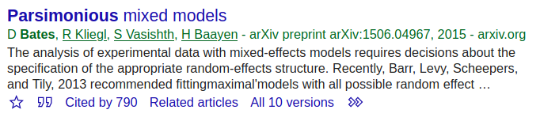
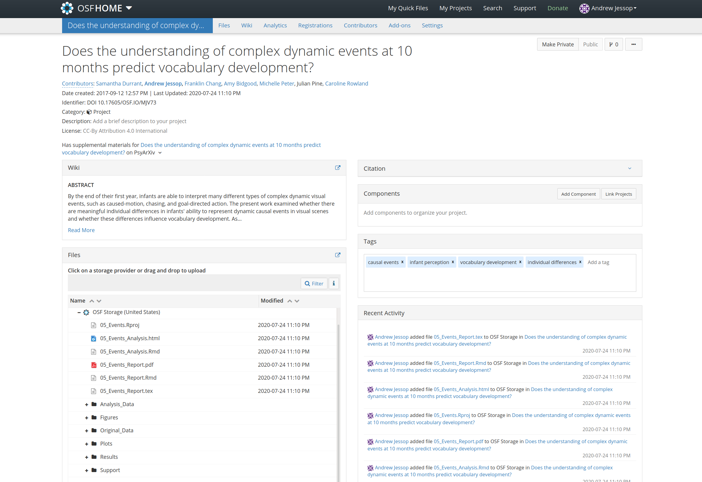

```{r setup, include=FALSE}

knitr::opts_chunk$set(echo = FALSE, warning = FALSE)
library(ggplot2)
library(ggsci)
library(scales)
library(tidyr)
library(ggpubr)
library(knitr)
set.seed(200616065)
trek <- c("#D43F3AFF", "#357EBDFF", "#5CB85CFF")

format_plot <- function(p) {
  p <- p + theme_bw()
  p <- p + theme(plot.title = element_text(lineheight=.8, size=16, hjust = 0.5),
               axis.title = element_text(face="bold", size = 14, color="black"),
               axis.text = element_text(size = 12, color="black"),
               axis.title.x = element_text(margin = margin(t = 10, r = 0, b = 0, l = 0)),
               axis.title.y = element_text(margin = margin(t = 0, r = 0, b = 0, l = 10)),
               panel.border = element_rect(colour = "black"),
               panel.background = element_rect(fill = "white", colour = "white"),
               plot.background = element_rect(fill = "white", colour = "white"),
               legend.key.size = unit(1,"line"),
               legend.title = element_text(face = "bold", size = 13),
               legend.text = element_text(size = 13),
               legend.position="right",
               panel.grid.major = element_blank(),
               panel.grid.minor = element_blank(),
               axis.ticks = element_line(colour = "black"),
               strip.text = element_text(size = 16, color="black"),
               strip.background = element_rect(fill = "white", colour = "black"))
  p <- p + scale_fill_manual(values=trek)
  p <- p + scale_colour_manual(values=trek)
  p <- p + scale_shape_manual(values=c(21, 22))
  return(p)
}

```


## Future meetings

- Talks on analysis methods and when to use them

- Tutorials and walkthroughs on core methods 

- Talks on research best practice (e.g., open science)

- Simulation and machine (deep) learning

- Guest speakers (suggestions?)

- Feedback on models for your projects


## If you have suggestions...

- ...contact Andrew, Perrine, or Colin on Slack

## Summary

- A brief introduction to open science

- What is reproducibility in research?

- Why does reproducibility and transparency matter?

- How to do it?

## [What is Open Science?](https://osaos.codeforscience.org/what-is-open/)

- Making research processes and outcomes **transparent** and **freely available** for use, reuse, remixing, and sharing

- To make the primary outputs of publicly-funded research (results, publications and the research data) publicly accessible in digital format with **no or minimal restriction**

## In a nutshell...
- Open science just means posting your research files to a public website and attaching an open source licence

- A simple idea at the centre of an important movement

## What can be made open?
- [Anonymized data](https://osf.io/) ([TalkBank](https://talkbank.org/); [Wordbank](http://wordbank.stanford.edu/))

- [Articles](https://openscience.com/green-gold-gratis-and-libre-open-access-brief-overview-for-beginners/) ([PsyArXiv](https://psyarxiv.com/); [Language Development Research](www.languagedevelopmentresearch.com))

- [Materials/stimuli](https://osf.io/) ([Example](https://osf.io/pkxzh/))

- [Source code](https://opensource.com/resources/what-open-source) ([GitHub](https://github.com/); [GitLab](https://about.gitlab.com/))

- [Research plans](https://www.cos.io/initiatives/prereg) ([RSOS](https://royalsocietypublishing.org/journal/rsos); [OSF](https://www.cos.io/initiatives/prereg))

- [Presentations/posters/lectures](https://figshare.com/about) ([Example](https://doi.org/10/fcmr))

- Books ([Advanced R](https://adv-r.hadley.nz/))

You can get a [badge](https://www.psychologicalscience.org/publications/badges) for your paper

## What are the advantages?
- Transparency -- Easier to understand papers

- Improves trust among peers -- you can verify the stimuli/analyses described in a paper

- Research and public funding can have a wider impact -- data can be reused by other researchers to answer new questions (e.g., power analyses, meta-analyses, cognitive models, etc.)

- Stimuli can be reused for closer replications (Durrant et al., 2020)

## What are the advantages?
- Saves time and money

- Improves the diversity of the field -- some Universities can't afford journal subscriptions (see [Cost of knowledge protest](https://en.wikipedia.org/wiki/The_Cost_of_Knowledge))

- Others can learn from your scripts

- Some journals require open data, analyses, and materials

- Large open science repositories and projects make it possible to address difficult questions ([CHILDES](https://childes.talkbank.org/), [Wordbank](http://wordbank.stanford.edu/), [ManyBabies](https://manybabies.github.io/), [MetaLab](http://metalab.stanford.edu/))


## What are the disvantages?
- <span style="color:#C00000;"><strong>MOSTLY ISSUES IN PRACTICE NOT PRINCIPLE</strong></span> 

- Possible misuse of highly sensitive data

- Some papers can remain preprints forever without ever being formally peer-reviewed

- Openness alone won't solve the replication crisis

## Is this a problem?



## What are the disvantages?

- <span style="color:#C00000;"><strong>MOSTLY ISSUES IN PRACTICE NOT PRINCIPLE</strong></span> 

- Possible misuse of highly sensitive data

- Some papers can remain preprints forever without ever being formally peer-reviewed

- **Openness alone won't solve the replication crisis**

## {data-background="crisis.png"}

## Why is this a problem?

- Slows progress

- Literature pollution -- we don't know for sure what's real (reliable) and what isn't

- Reduces respect of the science

- Can ruin someone's PhD and possibly their career


## [Why is there a crisis?](https://thewire.in/science/replication-crisis-science)

- Misuse of statistics is a big reason -- p-hacking and NHST more generally

- Most studies are underpowered -- first mentioned in Cohen (1962), but hasn't improved much since then (Button et al., 2013; Smaldino & McElreath, 2016) -- less than 40% power seems typical

- Misrepresentation of exploratory analyses (preregistrations)

- **Lack of transparency and reproducibility makes impossible to retrace our steps**


## Reproducibility != Replicability

- Replication = between-study reliability

- Reproducibility = within-study reliability


## Replication

- **External verification**

- A study is considered to be replicated when it is repeated with a new sample (subject/items) and the same basic findings are observed

- Helps determine whether the results can be generalized


## Reproducibility

- **Internal verification**

- A study is reproducible when another investigator can use the original **raw data** to arrive at the same results

- Starts at the data analysis stage, and helps trace exactly how the raw data was used to obtain the results/conclusions in a final report/presentation

- Typically involves using code


## Reproducibility != Replicability

- You could replicate a study without being able to reproduce the original findings

- You could reproduce the original analyses but not independently replicate the results


## {data-background="crisis.png"}


## Why is Reproducibility important?

- It is one of the few things that an investigator can guarantee about a study

- Without it, we may never fully-understand a non-replication

- Helps to find errors (verification)

- Reduces the need for trust


## {data-background="linus.jpg"}


## What does reproducibility look like?

- Any workflow that shows *everything* you've done to your raw data in a transparent and tracable way

- Even small changes like moving/renaming files

- Other researchers should be able to *see* what you have done without having to ask you!


## Code helps with this

- Reproducibility can be achieved when *everything* is done using code saved in scripts (R/Python/Julia/bash etc.)

- These scripts provide a record of how the final product was created (including possible errors!)

- Comments can be used to explain all important decisions


## How to break reproducibility

- Copy-and-paste

- Wrangling the raw data in spreadsheets (at the analysis stage), but maybe Excel should be banned in research? ([McElreath talk](https://www.youtube.com/watch?v=zwRdO9_GGhY), [COVID-19 error](https://www.bbc.com/news/amp/technology-54423988))

- Time-travelling -- making changes to the data without rerunning the analyses

- Missing information (e.g., package versions, dependencies)

- Ungeneralised code (e.g., hard-coded file paths)

- No seed number!


## What can I make reproducible?

- **Analysis notebooks** (HTML, Jupyter)

- **Written reports like journal articles or a PhD thesis (PDF, Word Documents)**

- Presentations (LaTeX Beamer, reveal.js)

- Websites ([Wordbank](https://github.com/langcog/wordbank))

- Books ([Advanced R](https://github.com/hadley/adv-r))


## How? 

- R ([R Projects](https://support.rstudio.com/hc/en-us/articles/200526207-Using-Projects), [RMarkdown](https://bookdown.org/yihui/rmarkdown/), [Jupyter](https://www.datacamp.com/community/blog/jupyter-notebook-r))

- Python ([Cookiecutter](https://drivendata.github.io/cookiecutter-data-science/),  [Conda Environment](https://docs.conda.io/projects/conda/en/latest/user-guide/tasks/manage-environments.html), [Jupyter/IPython](https://www.dataquest.io/blog/jupyter-notebook-tutorial/), [PWeave](http://mpastell.com/pweave/))

- Julia ([DrWatson](https://juliadynamics.github.io/DrWatson.jl/dev/), [JuliaMD](https://github.com/tshort/JuliaMarkdown) and [Weave](https://weavejl.mpastell.com/stable/), [Jupyter/IJulia](https://github.com/JuliaLang/IJulia.jl))

- [LaTeX](https://www.latex-project.org/) ([Overleaf](https://www.overleaf.com/)) or MD with [Pandoc](https://pandoc.org/) 

- All of these are open source (but MATLAB isn't, so it's not on the list)


## https://osf.io/mjv73/



## How to structure your project

- A single project directory containing everything necessary for creating the analysis and report

- This *entire* directory needs to be shared


## Keep things organised! 

- Make it easy for other investigators to navigate

- Use separate subdirectories for major components (but be careful with renaming!)


## Keep the analysis and the manuscript separate 

- Complex analyses can take a while

- R Markdown can create HTML notebooks as a complete record of your analysis (see example)

- R Markdown can also make APA-style PDFs (see example) and Word Documents (see [my GitHub](https://github.com/andrew-jessop/apa-word-docx-in-rmarkdown))


## Reproducible analyses

- Ideally, try to use one well-organised script to avoid errors and time-travelling -- not always possible, but be careful when using multiple scripts

- Save the plots as high-resolution images using code! (*ggsave*)

- Export the results into a separate folder using code! (*write.csv*)


## Manuscripts in R Markdown

- [ggplot2](https://ggplot2.tidyverse.org/) package for plots

- [xtable](https://cran.r-project.org/web/packages/xtable/vignettes/xtableGallery.pdf) package for tables

- A [CSL](https://github.com/citation-style-language/) file for APA references

- A custom *LaTeX* style sheet to apply APA-formatting ([Here's mine](https://github.com/andrew-jessop/apa-pdf-in-rmarkdown)) 

- [Zotero](https://www.zotero.org/) to manage references, [Better BibTeX](https://retorque.re/zotero-better-bibtex/) to export your library as a bibtex file


## Other packages

- *papaja*: Prepare APA journal articles with R Markdown


## Naming conventions

- Try to follow standard conventions for naming folders/files and writing code

- [Tidyverse style guide](https://style.tidyverse.org/) for R

- [PEP8 style guide](https://www.python.org/dev/peps/pep-0008/) for Python

- [Julia style guide](https://docs.julialang.org/en/v1/manual/style-guide/)

- Try to also use [folder naming conventions](https://github.com/KriaSoft/Folder-Structure-Conventions)


## Rules of reproducibility

- Rule 1 -- [Data is immutable](https://drivendata.github.io/cookiecutter-data-science/) (read-only) 

- Use packages like [tidyverse](https://www.tidyverse.org/) to preprocess your data for analysis

- Never make changes by hand (in Excel)

- Don't even correct typos or change column names by hand!

- Exception: if you version the files using Git so that the originals can be retrieved 


## Rules of reproducibility

- Rule 2 -- Do everything in code

- Don't copy-paste, change file/folder names, move files, or use GUI features (menus/buttons)

- Instead, use scripts to load/move files, preprocess data, and prepare reports

- Critical test -- another (knowledgeable) person should be able to run your script with minimal guidance


## Rules of reproducibility

- Rule 3 -- Use notebooks to *transparently* communicate your analyses

- Don't just use standard scripts for analyses

- Every analysis should have a static document that shows the code, plots, results, and dependency list

- This document should be regenerated whenever changes are made to the script (no time travelling)


## Rules of reproducibility

- Rule 4 -- Generalise your code 

- Use a seed to regenerate random numbers

- No hard-coded file paths (e.g., /andrew/Documents/project/analysis.R) -- you don't need them in an RProject 


## Rules of reproducibility

- Rule 5 -- Manage/report your software dependencies 

- New versions of language and packages can break your project or change your results, so it's important to document this

- At the very least, provide information about the language/package versions

- Ideally, you want to use a full dependency management system -- [Conda](https://docs.conda.io/projects/conda/en/latest/user-guide/tasks/manage-environments.html) for Python, [Pkg](https://docs.julialang.org/en/v1/stdlib/Pkg/) or [DrWatson](https://juliadynamics.github.io/DrWatson.jl/dev/) for Julia, [Packrat](https://rstudio.github.io/packrat/) for R, or even a full [Docker image](https://www.docker.com/)

- [Nextjournal](https://nextjournal.com/) is a new option that makes dependency management and collaborating on code very easy


## Other things to consider

- Version control using [Git](https://towardsdatascience.com/a-quick-primer-to-version-control-using-git-3fbdbb123262)

- [Unit testing throughout the pipeline](https://towardsdatascience.com/unit-testing-for-data-scientists-dc5e0cd397fb)

- The [Cookiecutter guide](https://drivendata.github.io/cookiecutter-data-science/) on data science best practices


# Questions?

- https://osf.io/mjv73/

- https://github.com/andrew-jessop/
